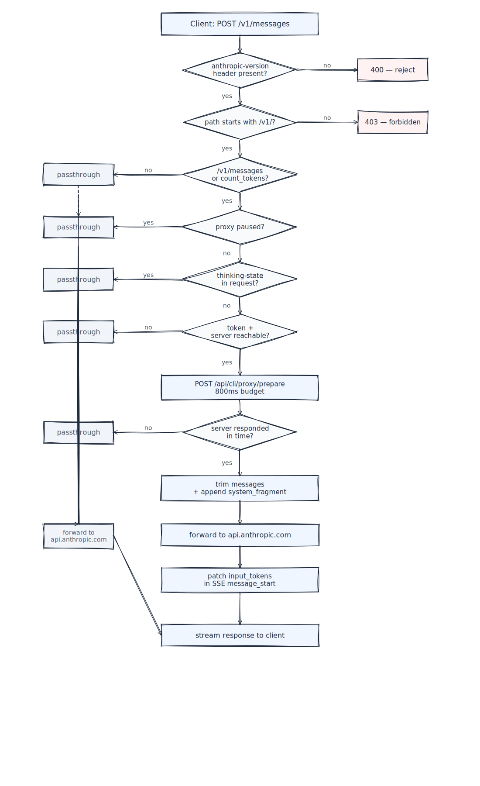
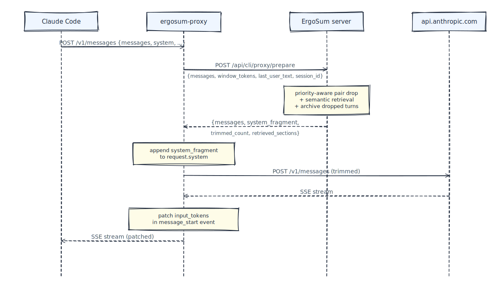
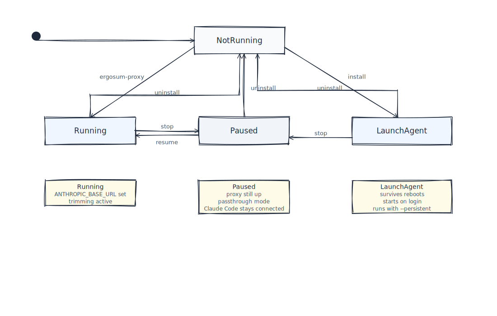
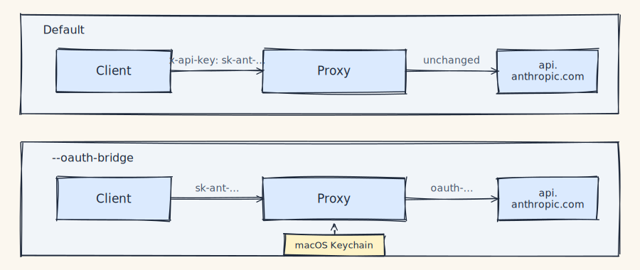

# ErgoSum Proxy

The local proxy that sits between Claude Code (or any Anthropic/OpenAI-compatible client) and `api.anthropic.com`. Intercepts `/v1/messages`, asks the ErgoSum server to trim the message array and assemble a context fragment, then forwards the result upstream.

This is the client-side binary. It is intentionally thin — no retrieval logic, no tagging schema, no context templates live in this code. All of that runs server-side at `ergosum.cc` (or wherever you point `ERGOSUM_URL`).

## Why this is open source

You are piping every Claude Code request through this proxy. That's a trust ask. Open-sourcing the binary lets you audit exactly what the proxy does to your traffic before you run it.

What you'll find in the audit:

- Only hits `api.anthropic.com` and the public `/api/cli/proxy/*` endpoints on your ErgoSum server
- No hardcoded tokens, keys, or URLs beyond those two
- Token read from local `conf` storage (`~/.config/ergosum/`) or `ERGOSUM_TOKEN` env var
- Optional OAuth bridge reads Claude Code's own token from macOS keychain via the official `security` command
- All file writes are to user-local paths (`~/.config/ergosum/`, `~/.claude/settings.json`, `~/.codex/config.toml`, `~/Library/LaunchAgents/`)
- Server failures (unreachable, timeout >800ms) fall through to passthrough mode — the original request is forwarded untrimmed
- Defensive hardening: rejects requests missing `anthropic-version` header, validates path prefix, bounded timeouts on every network call

## Install

```bash
npm install -g @ergosum/proxy
```

## Use

```bash
# Start the proxy in the background (port 49200)
ergosum-proxy

# Check status
ergosum-proxy status

# Tail live logs
ergosum-proxy logs

# Pause trimming (proxy stays running, becomes a passthrough — no dropped connection)
ergosum-proxy stop

# Install as a macOS LaunchAgent so it survives reboots
ergosum-proxy install

# Remove everything
ergosum-proxy uninstall
```

The proxy sets `ANTHROPIC_BASE_URL=http://localhost:49200` in `~/.claude/settings.json` while running and clears it on uninstall.

## Config

| Env var | Default | Purpose |
| --- | --- | --- |
| `ERGOSUM_URL` | `https://ergosum.cc` | Base URL for the ErgoSum server |
| `ERGOSUM_TOKEN` | (read from `conf`) | Auth token for the server |

If neither a token nor a reachable server is available, the proxy runs in passthrough mode — every request is forwarded untrimmed to `api.anthropic.com`.

## How it works

### Request flow

Every request goes through the same decision tree. Any passthrough branch means the request is forwarded to `api.anthropic.com` **untouched** — no trimming, no injection, no modification beyond the hop itself.



### Prepare exchange

The only content-aware call the proxy makes. Everything it sends, everything it gets back:



### Lifecycle



`stop` and `uninstall` are different on purpose: killing the proxy while Claude Code has `ANTHROPIC_BASE_URL` pointed at it would break the live session. `stop` instead flips the proxy into passthrough mode so the connection stays open while trimming pauses.

### Auth modes

The proxy touches one header: `x-api-key`. Default mode forwards it unchanged. `--oauth-bridge` swaps it with the Claude Code OAuth token read from the macOS keychain — nothing else.



`Authorization: Bearer …` headers (OpenAI, Codex, any other provider) are never touched in either mode.

## Modes

- `inject` (default) — priority trim + retrieval + system fragment injection
- `smart` — GPT-based compression of old turns server-side

Set via `ergosum-proxy --mode inject|smart`.

## Security notes

- The proxy validates every request has an `anthropic-version` header to raise the bar against local process abuse
- Only paths matching `/v1/*` are forwarded; all others return 403
- Upstream host is hardcoded to `api.anthropic.com` — no SSRF surface
- All network calls have bounded timeouts
- The proxy never logs request bodies; only request counts and token estimates to `/tmp/ergosum-proxy.log`

## Contributing

PRs welcome. Before submitting:

- Run `npm run typecheck` and `npm run build` locally
- For non-trivial changes, open an issue first to discuss the approach
- Keep the proxy thin — retrieval logic, tagging schemas, and context templates belong server-side, not in this binary

## Security

See [SECURITY.md](./SECURITY.md). Report vulnerabilities privately to `security@ergosum.cc`.

## License

MIT. See [LICENSE](./LICENSE).

## Related

- Main ErgoSum site: https://ergosum.cc
- MCP server: (coming soon)
- CLI: (installed separately)
